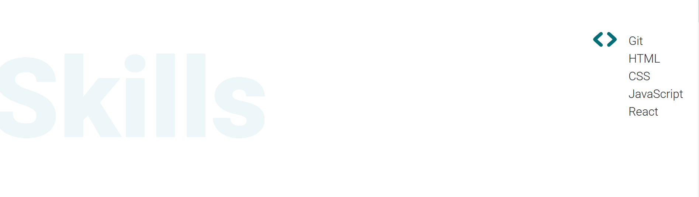
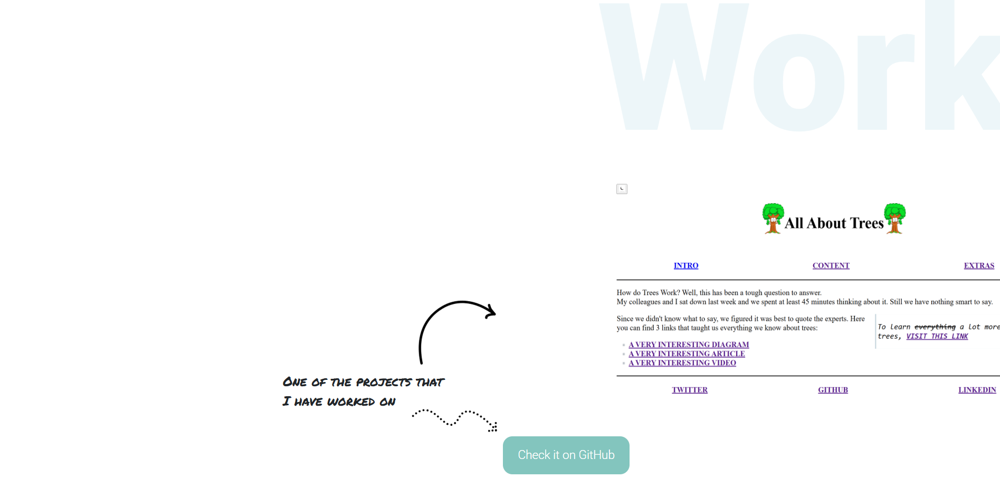

# My portfolio

> A showcase of my skills, projects, and experience, created to highlight my
> work and abilities.

## Table of contents

- [My portfolio](#my-portfolio)
  - [Table of contents](#table-of-contents)
  - [General info](#general-info)
  - [Screenshots](#screenshots)
  - [Technologies](#technologies)
  - [Setup](#setup)
  - [Code Examples](#code-examples)
  - [Features](#features)
  - [Status](#status)
  - [Inspiration](#inspiration)

## General info

> My portfolio, is a simple website to check my info and to reach me out.

## Screenshots

### Intro section


### Skills section



### Works section



### About section


### Contact section


## Technologies

- Node 19.7.0
- VS code
- Html
- CSS

## Setup

- clone the repository
- `npm install`

## Code Examples

```html
<!-- Navigation bar -->
<nav class="navbar navbar-expand py-0">
  <div class="collapse navbar-collapse justify-content-end" id="navbarNav">
    <ul class="navbar-nav">
      <li class="nav-item">
        <a href="#about" class="nav-link nav-text py-0">About</a>
      </li>
      <li class="nav-item">
        <a href="#skills" class="nav-link nav-text py-0">Skills</a>
      </li>
      <li class="nav-item">
        <a href="#works" class="nav-link nav-text py-0">Works</a>
      </li>
      <li class="nav-item">
        <a href="#contact" class="nav-link nav-text py-0">Contact</a>
      </li>
    </ul>
  </div>
</nav>
```

## Features

List of features ready and Todos for future development

- [x] navbar
- [x] into section
- [x] skills section
- [x] works section
- [x] about section
- [x] contact section

To-do list:

- [ ] make the website responsive

## Status

Project is: _in progress_

## Inspiration

Project by
[Amy Oulton](https://dev.to/amyoulton/create-a-portfolio-website-with-only-html-css-5bki)
